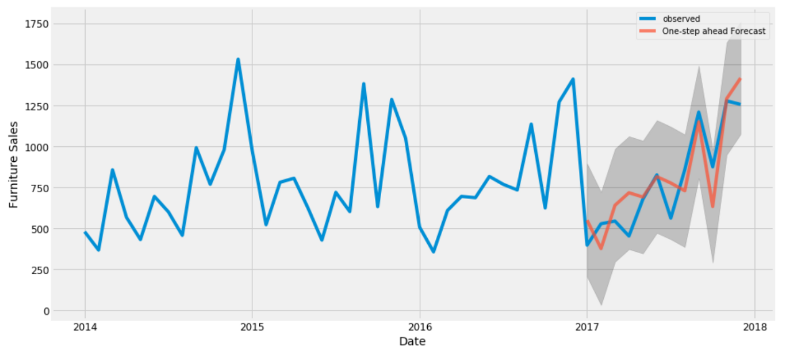

# Series de tiempo
Exploración y modelamiento de series de tiempo en Python. La principal guía del proyecto será el API Reference de la librería `statsmodels`: https://www.statsmodels.org/stable/api.html

  

El estudio de series de tiempo se divide por lo siguiente:
1. [Conceptos: desestacionalización, índices, entre otros](https://github.com/mauricioalvaradoo/econometrics/blob/main/macroeconometrics/1%20Introduction.ipynb)
2. [Series estacionarias](https://github.com/mauricioalvaradoo/econometrics/blob/main/macroeconometrics/2%20Stationary.ipynb)
3. [Series no estacionarias: raíz unitaria](https://github.com/mauricioalvaradoo/econometrics/blob/main/macroeconometrics/3%20UnitRoot.ipynb)
4. [Modelos multivariados: VAR y SVAR con sus IRFs y FEVDs](https://github.com/mauricioalvaradoo/econometrics/blob/main/macroeconometrics/4%20Multivariate.ipynb)
5. [Cointegración](https://github.com/mauricioalvaradoo/econometrics/blob/main/macroeconometrics/5%20Cointegration.ipynb)
6. [Filtros: HP, BK, CF, entre otros](https://github.com/mauricioalvaradoo/econometrics/blob/main/macroeconometrics/6%20Filters.ipynb)
7. [Modelos de volatilidad: ARCH y GARCH](https://github.com/mauricioalvaradoo/econometrics/blob/main/macroeconometrics/7%20Volatilily.ipynb)
8. Econometría bayesiana

Se usará las librerías `statsmodels` y `arch`.
