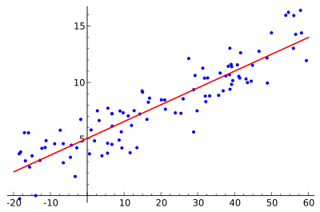

# Estudio de las principales herramientas para el estudio de corte transversal
Exploración y modelamiento de variables mediante corte trasversal y datos panel. La principal guía del proyecto será el API Reference de la librería `statsmodels`: https://www.statsmodels.org/stable/api.html

  

El estudio de modelos de corte trasversal y datos panel se divide por los siguientes:
1. Modelo de regresión lineal.
2. Otros temas de regresión.
3. Modelo lineal sin supuestos.
4. Variable dependiente binominal.
5. Variable dependiente multinomial.
6. Datos panel.
